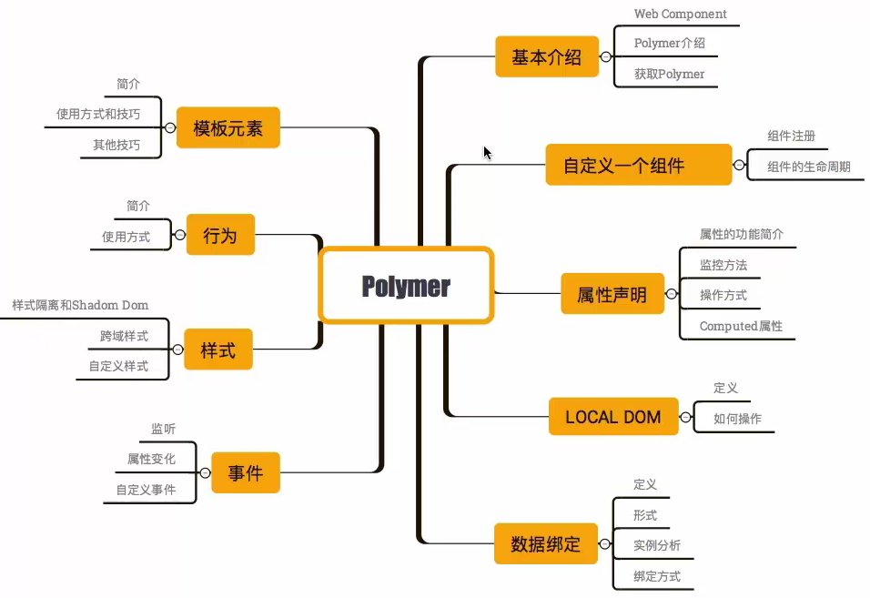

*polymer-study*
课程大纲


[toc]

## Polymer 入门教程 - 目标
* 了解 Web Component
* 学会 Polymer

## 什么是Web组件
* Custom Elements 自定义元素标签
* HTML Templates  HTML模版
* Shadow DOM      影子DOM
* HTML Imports    新型导入方法

### 浏览器支持

> Firefox对大多数功能提供实验性支持，默认是关闭的，看起来会在大概63版本的时候默认开启 
> 在Firefox中启用自定义元素和影子DOM，将 dom.webcomponents.customelements.enabled 和dom.webcomponents.shadowdom.enabled 设置为true。
> 在浏览器地址输入 `about:config` 搜索 `dom.webcomponents` 切换这两个 布尔值 为 true

[Web Components MDN](https://developer.mozilla.org/zh-CN/docs/Web/Web_Components)


### Custom Elements
* 创建一个自己的元素标签
* div p input select
* area-select - 实现三级联动

```
<!DOCTYPE html>
<html lang="en">
<head>
  <meta charset="UTF-8">
  <meta name="viewport" content="width=device-width, initial-scale=1.0">
  <meta http-equiv="X-UA-Compatible" content="ie=edge">
  <title>什么是Web组件</title>
</head>
<body>
  <nav>
    <a href="tem.html" target="_blank">HTML Template</a>
    <a href="shadow.html" target="_blank">Shadow DOM</a>
    <a href="import.html" target="_blank">IMPORT</a>
    <a href="example.html" target="_blank">EXAMPLE</a>
  </nav>
  <area-select>
    <span>custom elements</span>
  </area-select>
</body>
  <script type="text/javascript">
    document.registerElement('area-select', {
      proptotype: Object.create(HTMLElement.proptotype, {
        createdCallback: {
          value: function() {
            this.innerHTML = '<h1>自定义元素标签</h1>'
          }
        }
      })
    })
  </script>
</html>
```

### HTML Templates
* 原来的实现方式 - div + id， handlebars + js
* 直接 template 标签
* 可以操作，不渲染，纯粹的模版

### Shadow DOM
* 一个你自己的DOM tree
* 环境隔离
* 内部可以操作

```
<!DOCTYPE html>
<html lang="en">
<head>
  <meta charset="UTF-8">
  <meta name="viewport" content="width=device-width, initial-scale=1.0">
  <meta http-equiv="X-UA-Compatible" content="ie=edge">
  <title>Shadow DOM</title>
</head>
<body>
  <my-element>
    <p>Shadow DOM</p>
  </my-element>
</body>
<script type="text/javascript">
  document.registerElement('my-element', {
    prototype: Object.create(HTMLElement.prototype, {
      createdCallback: {
        value: function() {
          var shadow = this.createShadowRoot();
          shadow.innerHTML = '<h1>SHADOW DOM!</h1>' + '<content select="p" />'
        }
      }
    })
  })
</script>
</html>
```

### HTML Imports
* 引入方式，不在依靠 js
* 类似 css 的 link 或者 nodejs 的 require

```
# import.html

<!DOCTYPE html>
<html lang="en">
<head>
  <meta charset="UTF-8">
  <meta name="viewport" content="width=device-width, initial-scale=1.0">
  <meta http-equiv="X-UA-Compatible" content="ie=edge">
  <title>IMPORT</title>

  <link rel="import" href="heart.html">
</head>
<body>
  <script type="text/javascript">
    var heart = document.querySelector('link[ref="import"]').import
    var article = heart.querySelector('.heart')
    document.body.appendChild(article.cloneNode(true))
  </script>
</body>
</html>
```

```
# heart.html

<article class="heart">
  <h2>这就是 import 的方式导入</h2>
</article>
```

## Polymer 简介

### Web Component 优缺点
* 优点：标准化的组件定义方式，提供风格一致的封装机制
* 缺点：浏览器支持不明朗，原生 API 需要封装

### Polymer 是什么
> The Polymer library is designed to make it easier and faster for developers to create great, reusable components for the modern web.

### Polymer能做什么
* 抹平浏览器的差异，实现 Web Components 规范的 polyfill
* 核心框架 其实就是基于 DOM 对象本省的 MVVM，理念是 DOM 就是 ViewModel
* 在核心框架基础上附加的组件系统

> Custom elements
> Polymer library
> Web Components primitives

* Web Components - 提供原生api建立组件，自定义元素，但是工作量大，而且浏览器有差异
* Polymer        - 简单方式创建组件和元素，并且还有双向绑定，模版，属性监听等功能
* Custom Elements- 自定义元素，或者使用 Polymer 已经提供的

[elements.polymer-project](https://www.webcomponents.org/collection/Polymer/elements)

### Polymer 使用 - 创建 APP
#### Polymer 下载安装
[Install Polymer 3.0](https://www.polymer-project.org/3.0/start/install-3-0)

> Optional: Download and serve a sample Polymer 3.0 app

```
git clone https://github.com/PolymerLabs/start-polymer3.git
cd start-polymer3
npm install
polymer serve
```

Polymer 文件夹下 `\start-polymer3\node_modules\@polymer\polymer\dist\compiled\`

* web components js - 抹平浏览器差异
* polymer.html      - 对 web component 使用层面的封装

#### 初始化 polymer project

```
mkdir my-app
cd my-app

polymer init   - 使用 polymer 模版初始化
```

 可以选择 `polymer-3-starter-kit `

使用 `polymer serve` 启动服务，可以看到界面


这个时候的项目目录结构

```
images/
index.html             # main entry point into your app
manifest.json          # app manifest configuration
node_modules           # installed npm dependencies used in your app
package-lock.json      # dependency management file generated by npm
package.json           # npm metadata file
polymer.json           # Polymer CLI configuration 
service-worker.js      # auto-generated service worker
src/                   # app-specific elements
  my-app.js            # top-level element
  my-icons.js          # app icons
  my-view1.js          # sample views or "pages"
  my-view2.js
  my-view3.js
  my-view404.js        # sample 404 page
  shared-styles.js     # sample shared styles
sw-precache-config.js  # service worker pre-cache configuration
test/                  # unit tests
```

#### 添加一个新的页面
1.下一步创建一个新的页面在`src/my-new-view.js`

```
/* Load the PolymerElement base class and html helper function */
import { PolymerElement, html } from '@polymer/polymer/polymer-element.js';
/* Load shared styles. All view elements use these styles */
import './shared-styles.js';

/* Extend the base PolymerElement class */
class MyNewView extends PolymerElement {
  /* Define a template for the new element */
  static get template() {
    return html`
      <style include="shared-styles">
        :host {
          display: block;

          padding: 10px;
        }
      </style>

      <div class="card">
        <div class="circle">1</div>
        <h1>New View</h1>
        <p>New view!</p>
      </div>
    `;
  }
}
/* Register the new element with the browser */
window.customElements.define('my-new-view', MyNewView);
```

这样就新建了一个 my-new-view 元素，现在可以在 my-app.js 中使用新的元素标签

2.添加新的page索引到iron-pages`<my-new-view name="new-view"></my-new-view>`

3.然后添加一个路由

```
_routePageChanged(page) {
  if (!page) {
    /* If no page was found in the route data, page will be an empty string.
        Default to 'view1' in that case. */
    this.page = 'view1';
  } else if (['view1', 'view2', 'view3', 'new-view'].indexOf(page) !== -1) {
    this.page = page;
  } else {
    this.page = 'view404';
  }
  ...
}
```

4.添加动态 import

```
      case 'new-view':
        import('./my-new-view.js');
        break;
```

5.再添加一个导航菜单 nacigation menu

`<a name="new-view" href="[[rootPath]]new-view">New View</a>`

启动 polymer serve 就可以看到页面的变化

#### 添加一个已有的组件

1.首先在根目录下安装组件对应的 npm 包 `npm install @polymer/paper-checkbox@next --save`

2.打开我们的`src/my-new-view.js`文件，并导入`paper-checkbox.js`

`import '@polymer/paper-checkbox/paper-checkbox.js';`

3.在`<h1>`标签下面添加我们引入的组件`<paper-checkbox>Ready to deploy!</paper-checkbox>
`

4.重启 polymer serve 查看变化

#### deploy部署
`polymer build`


### Polymer 使用 - 创建元素

#### Set up
使用 polymer 3.0 来创建一个简单的 button 元素像这样 `<icon-toggle></icon-toggle>`

1. 安装 Polymer CLi `npm install -g polymer-cli`
2. 下载开始的代码`git clone https://github.com/PolymerLabs/polymer-3-first-element.git`
3. 进入目录`cd polymer-3-first-element`,目录结构

```
README.md
demo
icon-toggle-finished
icon-toggle.js
index.html
package.json
polymer.json
```

4. 安装依赖并运行 demo

`npm install` `polymer serve `

#### 添加 Shadow DOM


